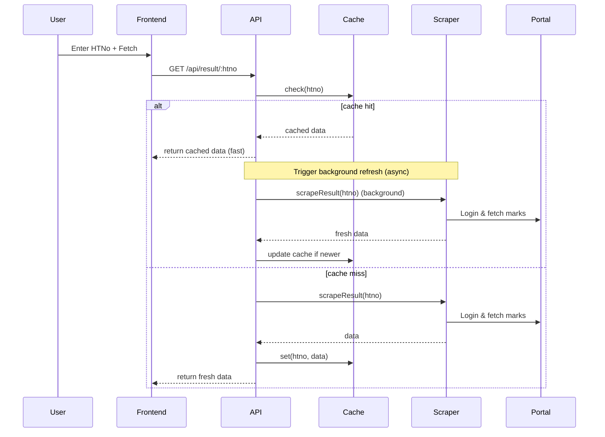
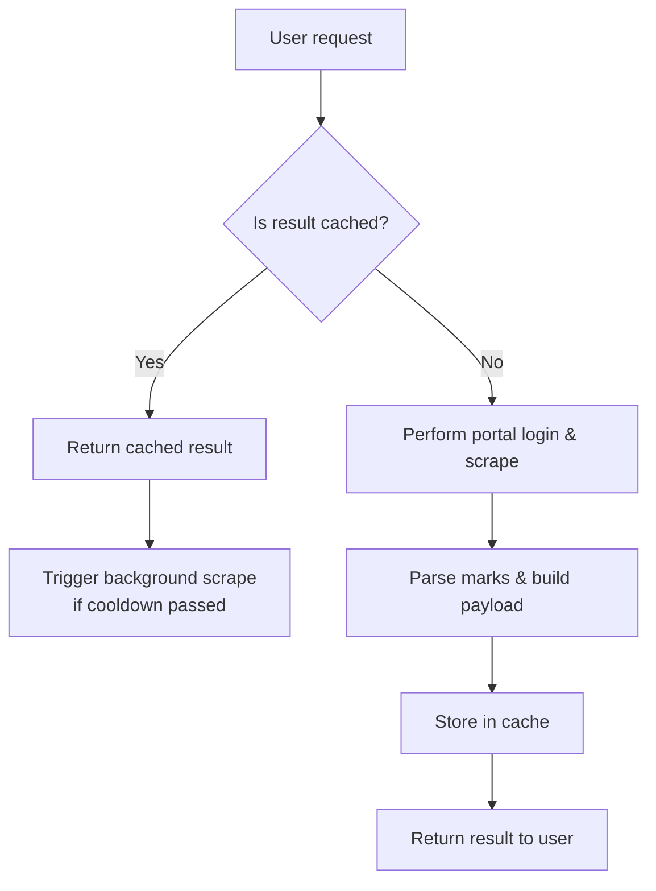

# AEC Smart Result Access System

> A polished, fast, and reliable caching proxy for the Aditya Engineering College exam portal — fetch results, serve cached copies, and reduce portal load.

---

## Project Overview

AEC Smart Result Access System provides a lightweight Express-based proxy that logs into the official AEC exam portal on behalf of a student (using their Hall Ticket Number), scrapes the latest published semester marks, and caches results in a TTL LRU in-memory cache. The system serves results instantly from cache when available and performs background refreshes to keep data up-to-date.

Key goals:
- Fast, snappy UX for students
- Perceived-instant results via a small browser-local cache and skeleton UI
- Reduce repeated portal load using caching and polite prefetching
- Safe rate-limited scraping with session isolation

---

## Tech Stack

- Node.js + Express — server and API
- Axios + axios-cookiejar-support + tough-cookie — sessioned HTTP scraping
- Cheerio — server-side HTML parsing
- express-rate-limit — request limiting
- Vanilla JS, CSS, HTML — lightweight responsive frontend in `public/`

---

## Code Structure

- `server/`
  - `index.js` — Express app entry point
  - `routes/api.js` — API endpoints and cache/fetch logic
  - `services/cache.js` — TTL + LRU in-memory caching and stats
  - `services/scraper.js` — portal scraping and parsing logic
  - `middleware/rateLimit.js` — global rate limiter and cooldown config
- `public/` — Single-page frontend (`index.html`, `app.js`, `style.css`)
- `package.json` — dependencies and start scripts

---

## High-Level Workflow

Mermaid sequence diagram (Execution flow):



---

## Execution Flowchart (mermaid)



---

## Running Locally (Quick Start)

Prerequisites:
- Node.js 20+ (recommended; uses node:20-alpine for Docker)

1. Install dependencies

```powershell
cd aec-result-system
npm install
```

2. Optional: create a `.env` file at project root with any of the following environment variables (defaults are safe):

```
PORT=3000
CACHE_TTL_MS=3600000           # 1 hour TTL default
MAX_CACHE_SIZE=1000
RATE_LIMIT_WINDOW_MS=60000
RATE_LIMIT_MAX=20
PORTAL_FETCH_COOLDOWN_MS=300000 # 5 minutes
```

3. Start the server

```powershell
npm start
# or for development
npm run dev
```

4. Open the frontend in your browser:

http://localhost:3000

---

## API Endpoints

- `GET /api/result/:htno` — fetch result for HTNo (query `?force=true` to force portal fetch)
- `GET /api/stats` — cache statistics (hits, misses, hit rate, size)
- `DELETE /api/cache/:htno` — evict cache entry for HTNo
- `POST /api/prefetch` — bulk prefetch (body: `{ htnos: [...] }`, max 20)
- `GET /api/cache/list` — list cached entries (admin)

---

## Frontend Usage

- Enter a Hall Ticket Number like `23A91A05I2` and click *Fetch Result*.
- Toggle *Force fresh fetch* to bypass cache and scrape portal immediately.
- The UI shows if data came from cache or portal and displays stats.
- Use the dark/light mode toggle (🌙/☀️ icon) in the header to switch themes.
- Visit the *Dev Team* page to meet the developers behind this project.

Notes on instant UX:
- The frontend maintains a short-lived localStorage cache for recently viewed HTNos so the UI can render instantly on repeat lookups while a background refresh updates the data.
- Skeleton placeholders and animated transitions make the interface feel faster and more polished.

---

## Dark Mode / Light Mode

The application supports both dark and light themes:
- Click the 🌙 / ☀️ icon in the header to toggle themes.
- Your preference is saved to localStorage and persists across sessions.
- Smooth color transitions ensure visual continuity when switching.

---

## Dev Team Page

Visit `/dev-team.html` to meet the developers:
- **Rama Lokesh Reddy Penumallu** — Full Stack Developer ([GitHub](https://github.com/ramalokeshreddyp) | [LinkedIn](https://www.linkedin.com/in/rama-lokesh-reddy/))
- **Raj Vincy Degapati** — Frontend Developer ([GitHub](https://github.com/Vincyyy07) | [LinkedIn](https://www.linkedin.com/in/raj-vincy-degapati/))

---

## Scalability & Deployment (Docker)

This project includes a `Dockerfile` and `docker-compose.yml` to run the app together with Redis for improved scalability and persistence.

Run with Docker Compose:

```powershell
cd aec-result-system
docker compose up --build
```

This starts two services:
- `app` — the Node.js application on port `3000`
- `redis` — optional cache backing store (the application currently uses in-memory cache but writes can be extended to use Redis)

Set `REDIS_URL` to enable Redis-backed features in future updates.

---

## Testing / Smoke Check

After starting the server, verify API health:

```powershell
curl http://localhost:3000/api/stats
```

You should receive JSON with `success: true` and cache stats.

Fetch an HTNo (replace with a real example):

```powershell
curl http://localhost:3000/api/result/23A91A05I2
```

If portal scraping is blocked or the portal is down, the API returns descriptive error messages and HTTP status codes (401, 429, 503, 500).

Automated smoke test:

```powershell
# Run a small smoke test (requires Node 18+)
npm run smoke
```

The `scripts/smoke-test.js` file performs a few basic checks and exits non-zero on failures.

---

## Configuration & Tuning Recommendations

- For production, run behind a process manager (PM2) or container orchestrator.
- Use a persistent cache (Redis) if you need cross-instance sharing and larger capacity.
- Increase `PORTAL_FETCH_COOLDOWN_MS` to be more polite to the official portal.
- Use HTTPS termination via a reverse proxy (Nginx) and enable HSTS.

---

## Security & Privacy Notes

- This project logs in to the official portal only with the student's HTNo used as username/password — the app does not store credentials; sessions use temporary cookie jars for isolation.
- Do not expose this service publicly without additional protections; consider auth before allowing bulk prefetch or cache listing.

---

## Contributing

1. Fork the repository
2. Create a branch for your feature
3. Open a PR with a description and tests

---

## License

MIT
