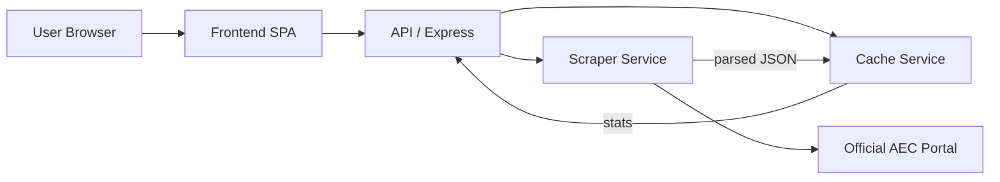

# Architecture & Design — AEC Smart Result Access System

**Purpose:** This document explains the system-level architecture, component responsibilities, data flow, and deployment recommendations for the AEC Smart Result Access System.

---

## System Overview

The system acts as a caching proxy between end users and the AEC exam portal. It performs ephemeral sessioned logins to the portal, scrapes the latest semester marks, and caches results to provide low-latency responses while reducing load on the official portal.

Primary components:
- Frontend SPA (`public/`) — user interface, minimal JS that calls API endpoints.
- API Layer (`server/routes/api.js`) — orchestrates cache checks, enforces cooldowns, returns results.
- Cache Service (`server/services/cache.js`) — in-memory TTL + LRU cache with stats.
- Scraper Service (`server/services/scraper.js`) — sessioned scraping using axios + tough-cookie + cheerio.
- Rate limiting (`server/middleware/rateLimit.js`) — protects API from abuse.

---

## Component Responsibilities

- Frontend: accepts HTNo, displays results, shows if data came from cache or portal.
- API Router: validates HTNo, enforces per-HTNo cooldown, decides cache hit/miss paths, triggers background refreshes.
- Cache Service: encapsulates storage, TTL enforcement, LRU eviction, and stats collection.
- Scraper Service: implements portal login flow (GET Login.aspx → doPostBack → POST credentials → GET marks page) and robust parsing.

---

## Architecture Diagram (mermaid)

---

## Data Flow & Execution Details

1. User requests result via frontend.
2. API checks cache:
   - If cached and valid: return cached payload and optionally trigger background scrape (if cooldown passed).
   - If not cached or forced: invoke `scrapeResult(htno)` → perform sessioned login and parse marks → return payload and set cache.
3. Cache entries include `data`, `fetchedAt`, and `ttl` for expiration.
4. API maintains an in-memory map to ensure per-HTNo cooldowns (`PORTAL_FETCH_COOLDOWN_MS`) to limit how often a fresh portal scrape occurs for the same HTNo.

---

## Why This Design

- In-memory cache keeps architecture simple and low-latency for a single-instance deployment.
- Sessioned scraping (fresh cookie jar per scrape) avoids cross-session leakage and prevents credential reuse.
- Background refresh strategy provides fast responses while ensuring cached data eventually becomes up-to-date.

---

## Scalability & Production Guidance

- Multi-instance: replace in-memory cache with Redis (key TTLs) and centralize cooldown tracking (e.g., Redis keys with expiries).
- Containerize with Docker for consistent runtime.
- Use a process manager (PM2) or orchestrator (Kubernetes) and a load balancer; prefer sticky sessions only if you keep cookies locally — better: centralize scraping workers.
- Implement API authentication for administrative endpoints (`/api/cache/list`, `/api/prefetch`, `DELETE /api/cache/:htno`).

---

## Reliability & Error Handling

- The scraper has defensive checks (detect login failures, missing form fields, portal changes) and surfaces meaningful HTTP status codes (401 for invalid HTNo, 503 for portal unreachable).
- Background refreshes do not block user responses and failures are logged.

---

## Security Considerations

- Do not store HTNo credentials; they are used only per-session to authenticate to the portal.
- Rate-limit endpoints and consider CAPTCHAs or API keys when exposing service publicly.
- Sanitize and validate all inputs.

---

## Deployment Checklist

- Move sensitive configs to environment variables and secret stores.
- Add monitoring (health checks, logs, cache hit/miss metrics exported to Prometheus/Grafana).
- Add TLS termination and enable HSTS.
- Harden rate limits and add authentication for admin routes.

---

## Tradeoffs (Pros / Cons)

- Pros:
  - Low latency for cached results
  - Simple single-repository codebase
  - Polite scraping with cooldowns

- Cons:
  - In-memory cache not shared across instances
  - Scraper is brittle to portal UI changes (requires maintenance)
  - Potential legal/ethical considerations when scraping third-party portals — ensure compliance
